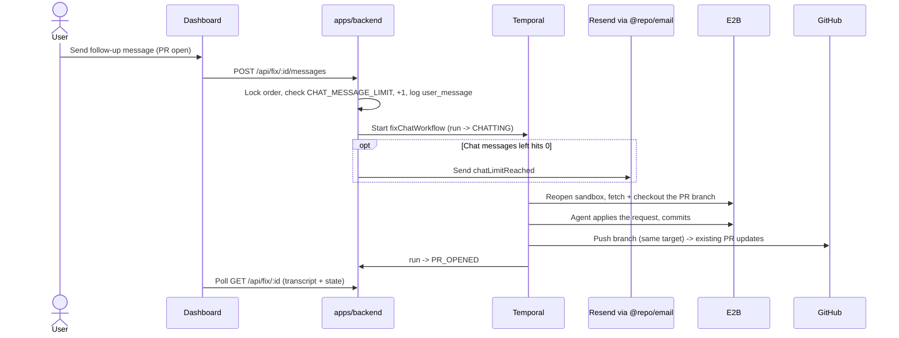

# GEO Repair System Flow

This document is the source diagram for how GEO Repair works end to end. Keep
the flowchart and sequence diagram aligned with the real route handlers,
workflow activities, providers, and persistence models.

## Current System Shape

- Public website: `apps/web` on `geo.repair`.
- Authenticated dashboard: `apps/dashboard-v2` on `dashboard.geo.repair`.
- Backend API: `apps/backend-v2`, Express routes under `/api`.
- Job plane today: Temporal workflows and workers in `apps/backend-v2/temporal`.
- Execution plane: E2B sandbox via `@repo/sandbox`, with the model/tool loop in
  `@repo/ai`.
- Persistence: Prisma models in `packages/db/prisma/schema.prisma`.
- Scan brand identity: the scraper extracts brand name, favicon URL, and logo
  URL from the scanned homepage's icons, metadata, and JSON-LD. Free scans
  return this identity in the scan result; completed project scans also update
  the `Project` brand fields. The database stores URLs only, not image files.
- Payments: Dodo one-time checkout, with webhooks as the payment source of
  truth and checkout-return reconciliation as a backup.
- Transactional email: `@repo/email` renders React Email templates and sends
  through Resend best-effort. Live notifications cover new accounts, scan
  completion/failure, billing receipt/failure/refund, fix plan ready, PR/no-change
  completion, fix failure, chat limit reached, waitlist, and contact.
- Entitlements: a paid `Order` grants a bounded number of fix attempts
  (`fixAttemptsUsed` / `FIX_ATTEMPT_LIMIT`) and post-PR agent chat messages
  (`chatMessagesUsed` / `CHAT_MESSAGE_LIMIT`). Free scans are bounded in the
  public scan API. Paid-order enforcement lives in
  `apps/backend-v2/functions/billing.service.ts`,
  `apps/backend-v2/functions/agent-plan.service.ts`,
  `apps/backend-v2/functions/fix.service.ts`, and
  `apps/backend-v2/functions/chat.service.ts`.
- AI Visibility: dashboard route `/dashboard/ai-visibility` is a coming-soon
  surface. Today it only records authenticated user interest in
  `feature_interests`; no monitoring workflow, AI platform call, report, or
  scoring path is live yet. Product intent lives in `docs/ai-visibility.md`.

`plan/plan.md` still describes some future pieces. In these diagrams,
implementation paths are shown as current; future branches are explicitly
marked `planned`.

## Flowchart

```mermaid
flowchart TD
  Visitor["Visitor"]
  Marketing["geo.repair marketing site<br/>apps/web"]
  CheckupForm["Free AI Search readiness checkup<br/>apps/web/components/checkup/checkup-form.tsx"]
  WebProxy["Next route handlers<br/>apps/web/app/api/checkups/*"]
  BackendCheckup["Express checkup API<br/>POST /api/checkups<br/>GET /api/checkups/:workflowId/status<br/>GET /api/checkup-reports/:key"]
  TemporalCheckup["Temporal checkup workflow<br/>checkupWorkflow"]
  CheckupWorker["Checkup worker activity<br/>runCheckup"]
  TargetSite["Customer website<br/>robots, sitemap, pages, markdown twins"]
  Checker["Crawler and rubric scoring<br/>apps/backend/src/temporal/functions/checkup/crawler"]
  CheckupDB["CheckupRun, CheckupRunEvent,<br/>CheckupReport"]
  BrandIdentity["Brand identity<br/>name, favicon URL, logo URL"]
  Result["Score, findings, page count,<br/>brand identity, website type, quote tier"]
  Unsupported["Unsupported no-code platform<br/>waitlist or contact"]
  DownloadReport["Download scan report"]
  DashboardScan["dashboard.geo.repair<br/>/dashboard/projects?website=..."]
  NeedAuth{"Signed in?"}
  GoogleOAuth["Google OAuth<br/>/api/auth/google?redirect_to=..."]
  NeedRepo{"GitHub connected?"}
  Settings["Connect GitHub<br/>preserve website handoff"]
  OAuth["GitHub OAuth<br/>/api/auth/github"]
  GitHub["GitHub API"]
  UserDB["User, Account, Project"]
  RepoMatch{"One safe repo match?"}
  RepoPicker["Repo picker<br/>website prefilled"]
  RepoConfirmed["Repo and website confirmed"]
  ProjectCreate["POST /api/projects<br/>create project and enqueue scan"]
  ProjectScan["Project scan<br/>scrapeWorkflow"]
  CheckoutDialog["Project buy-fix CTA<br/>Starter, Growth, Scale, custom"]
  BillingAPI["Billing API<br/>POST /api/billing/fix-checkout"]
  OrderDB["Plan, Order, PaymentWebhookEvent<br/>projectId, scrapingId, tier, amount, status"]
  Dodo["Dodo hosted checkout"]
  DodoWebhook["Dodo webhook<br/>/api/webhooks/dodo"]
  Email["Transactional email<br/>@repo/email via Resend"]
  ReturnPage["Checkout return page<br/>/checkout/return"]
  PaidOrder["Order PAID<br/>Start fix unlocked"]
  FixWorkspace["Dashboard purchase / project agent screen"]
  StartFix["POST /api/projects/:id/agent-plan<br/>requires paid matching order"]
  FixRunDB["AgentRun, AgentPlan,<br/>AgentPlanCheck, Log"]
  TemporalFix["Temporal fixSiteWorkflow"]
  PlanRun["planRun<br/>fresh scan, build fix plan,<br/>persist checks"]
  Clarify{"Clarification needed?"}
  Intake["Structured MCQ intake<br/>POST /api/fix/:id/intake"]
  Sandbox["E2B sandbox<br/>clone repo, create fix branch"]
  Agent["@repo/ai agent loop<br/>OpenRouter model plus sandbox tools"]
  Commit{"Commit produced?"}
  PushPR["Push branch and open PR<br/>GitHub REST"]
  NoChanges["Completed with no changes<br/>show summary"]
  Failed["Failed or support required"]
  Teardown["Teardown sandbox<br/>record sandbox COGS"]
  PRReady["PR opened<br/>dashboard transcript and summary"]
  Reports["Reports API<br/>/api/reports/generate"]
  ProjectReports["ProjectReport and ReportShareLink"]
  MergeWebhook["GitHub merge webhook<br/>planned"]
  Recheck["Post-merge re-check<br/>planned"]

  Visitor --> Marketing --> CheckupForm --> WebProxy --> BackendCheckup
  BackendCheckup --> TemporalCheckup --> CheckupWorker
  CheckupWorker --> TargetSite
  TargetSite --> BrandIdentity --> CheckupDB
  TargetSite --> Checker --> CheckupDB --> Result
  Result -->|"Framer, Webflow, Wix, WordPress, Shopify, unsupported"| Unsupported
  Result -->|"custom-coded site"| DownloadReport
  Result --> DashboardScan
  DashboardScan --> NeedAuth
  NeedAuth -->|"no"| GoogleOAuth --> UserDB --> NeedRepo
  UserDB -->|"new User"| Email
  NeedAuth -->|"yes"| NeedRepo
  NeedRepo -->|"no"| Settings --> OAuth --> GitHub --> UserDB --> RepoMatch
  NeedRepo -->|"yes"| RepoMatch
  RepoMatch -->|"yes"| RepoConfirmed
  RepoMatch -->|"no"| RepoPicker --> RepoConfirmed
  RepoConfirmed --> ProjectCreate --> ProjectScan --> CheckoutDialog --> BillingAPI --> OrderDB --> Dodo
  ProjectScan -->|"completed or failed"| Email
  Dodo --> DodoWebhook --> OrderDB
  Dodo --> ReturnPage --> OrderDB
  OrderDB -->|"paid, failed, refunded"| Email
  OrderDB --> PaidOrder --> FixWorkspace --> StartFix --> FixRunDB --> TemporalFix
  FixRunDB -->|"plan ready or failed"| Email
  TemporalFix --> PlanRun --> Clarify
  Clarify -->|"yes"| Intake --> TemporalFix
  Clarify -->|"no"| Sandbox
  Intake --> Sandbox --> Agent --> Commit
  Commit -->|"yes"| PushPR --> PRReady
  Commit -->|"no"| NoChanges
  Agent -->|"error"| Failed
  PushPR -->|"error"| Failed
  PRReady --> Email
  NoChanges --> Email
  Failed --> Email
  PRReady --> Teardown
  NoChanges --> Teardown
  Failed --> Teardown
  PRReady --> Reports --> ProjectReports
  PRReady --> MergeWebhook --> Recheck --> Reports
```

## Sequence Diagram

```mermaid
sequenceDiagram
  actor User
  participant Web as geo.repair apps/web
  participant Dashboard as dashboard.geo.repair apps/dashboard-v2
  participant API as apps/backend-v2 Express API
  participant Temporal as Temporal workflows
  participant Worker as Temporal workers
  participant Target as Customer website
  participant DB as Neon/Postgres via Prisma
  participant Google as Google OAuth
  participant GitHub as GitHub
  participant Dodo as Dodo Payments
  participant Email as Resend via @repo/email
  participant E2B as E2B sandbox
  participant AI as OpenRouter model via @repo/ai

  User->>Web: Enter website URL
  Web->>API: POST /api/checkups
  API->>DB: Create CheckupRun
  API->>Temporal: Start checkupWorkflow
  API-->>Web: workflowId

  loop Poll progress
    Web->>API: GET /api/checkups/:workflowId/status
    API->>Temporal: Describe/result workflow
    API->>DB: Read CheckupRun progress/events
    API-->>Web: Progress or completed result key
  end

  Temporal->>Worker: runCheckup
  Worker->>Target: Fetch pages, robots, sitemap, twins
  Worker->>Worker: Extract brand identity from homepage icons and JSON-LD
  Worker->>Worker: Crawl and score rubric findings
  Worker->>DB: Save report, progress events, and project brand URLs when applicable
  Worker-->>Temporal: CheckupResult
  Web->>API: GET /api/checkup-reports/:key
  API->>DB: Load saved report
  API-->>Web: Score, findings, website type, page count

  alt Unsupported platform
    Web-->>User: Show waitlist/contact path
  else Custom-coded site
    Web-->>User: Show score, quote, report download, fix CTA
  end

  User->>Dashboard: Continue to /dashboard/projects?website=...
  alt Not authenticated
    Dashboard-->>User: Redirect to /sign-in?next=/dashboard/projects?website=...
    Dashboard->>API: GET /api/auth/google?redirect_to=...
    API->>Google: OAuth authorization and token exchange
    Google-->>API: Google profile
    API->>DB: Upsert User and Account
    opt First User row created
      API->>Email: Send accountWelcome
    end
    API-->>Dashboard: Set auth cookie, redirect to preserved dashboard path
  end

  alt GitHub not connected
    Dashboard->>API: GET /api/auth/github?redirect_to=...
    API->>GitHub: OAuth authorization and token exchange
    GitHub-->>API: GitHub profile and token
    API->>DB: Link GitHub Account to current User
    API-->>Dashboard: Redirect to preserved dashboard path
  end

  Dashboard->>API: GET /api/github/repos
  API->>GitHub: List accessible repos
  GitHub-->>API: Repos
  API-->>Dashboard: Repo list
  alt One deterministic repo match for website
    Dashboard->>API: POST /api/projects
  else No safe match
    User->>Dashboard: Select repo and bind website
    Dashboard->>API: POST /api/projects
  end
  API->>DB: Save Project
  API->>Temporal: Start scrapeWorkflow best-effort
  API-->>Dashboard: Created project, scan starts in background
  Temporal->>Worker: scrapeWorkflow
  Worker->>DB: Save Scraping COMPLETED or FAILED
  Worker->>Email: Send checkupComplete or scanFailed

  User->>Dashboard: Buy fix from completed project scan
  Dashboard->>API: POST /api/billing/fix-checkout
  API->>DB: Create or reuse Order scoped to project and latest completed scan
  API->>Dodo: Create checkout session
  Dodo-->>API: checkoutUrl, session/payment ids
  API->>DB: Mark order CHECKOUT_CREATED
  API-->>Dashboard: checkoutUrl
  Dashboard-->>User: Redirect to Dodo checkout

  User->>Dodo: Pay
  Dodo-->>Web: Return to /checkout/return
  par Source of truth webhook
    Dodo->>API: POST /api/webhooks/dodo with raw signed body
    API->>DB: Store PaymentWebhookEvent and update Order
    API->>Email: Send paymentReceipt, paymentFailed, or refund
  and Return-page reconciliation
    Web->>API: POST /api/billing/public/orders/:id/reconcile when payment_id exists
    API->>Dodo: Retrieve payment
    API->>DB: Update Order if verified
    API->>Email: Send paymentReceipt when newly marked PAID
  end
  Web->>API: GET /api/billing/public/orders/:id
  API->>DB: Read order status
  API-->>Web: Minimal PAID unlock state, no repo or project data
  Web-->>User: Start fix link to dashboard purchase page

  User->>Dashboard: Start fix
  Dashboard->>API: GET /api/billing/orders/:id
  API->>DB: Read authenticated full order for user
  Dashboard->>API: POST /api/projects/:id/agent-plan with orderId
  API->>DB: Verify paid order matches user and project
  API->>DB: Create AgentRun and AgentPlan
  API->>Temporal: Start agentPlanWorkflow
  API-->>Dashboard: agentRunId, agentPlanId

  Temporal->>Worker: planRun
  Worker->>Target: Fresh checkSite scan
  Worker->>DB: Upsert FixCheck rows and RunEvent transcript
  Worker->>Email: Send fixPlanReady when AgentRun awaits input
  alt Clarification required
    Worker->>DB: Write agent_clarification_requested event
    Dashboard->>API: GET /api/fix/:fixRunId
    API->>DB: Read detail and events
    API-->>Dashboard: Clarification questions
    User->>Dashboard: Submit MCQ answers
    Dashboard->>API: POST /api/fix/:fixRunId/intake
    API->>DB: Persist intake
    API->>Temporal: Signal submitFixIntake
  end

  Temporal->>Worker: prepareSandbox
  Worker->>E2B: Create or reconnect sandbox
  Worker->>GitHub: Mint/resolve repo token
  Worker->>E2B: Clone repo and checkout geo-repair fix branch
  Worker->>DB: Update sandbox state and RunEvents

  Temporal->>Worker: runHarness
  Worker->>AI: Send prompt, failing checks, skills, intake
  loop Agent tool loop
    AI->>Worker: Tool call
    Worker->>E2B: Read, write, run commands in repo
    E2B-->>Worker: Tool result
    Worker->>DB: Append RunEvent
    Worker-->>AI: Tool result
  end
  Worker->>E2B: Check commit and collect diff summary
  Worker->>DB: Update FixCheck counters and COGS

  Temporal->>Worker: finalizeRun
  alt Commit exists
    Worker->>GitHub: Push branch and open pull request
    GitHub-->>Worker: PR URL and number
    Worker->>DB: Mark PR_OPENED and append pr_opened event
    Worker->>Email: Send fixPrOpened
  else No commit
    Worker->>DB: Mark COMPLETED and append no_changes event
    Worker->>Email: Send fixPrOpened no-change variant
  end

  Temporal->>Worker: teardownSandbox
  Worker->>E2B: Kill sandbox
  Worker->>DB: Record sandbox seconds and cost

  opt Planning or fix run fails
    Worker->>DB: Mark AgentRun FAILED
    Worker->>Email: Send fixFailed
  end

  loop Dashboard polling
    Dashboard->>API: GET /api/fix-runs and GET /api/fix/:fixRunId
    API->>DB: Read FixRun, FixCheck, RunEvent
    API-->>Dashboard: Transcript, PR, checks, costs-safe status
  end

  User->>Dashboard: Generate or share report
  Dashboard->>API: POST /api/reports/generate or share link routes
  API->>DB: Generate ProjectReport and ReportShareLink
  API-->>Dashboard: Report artifact

  opt Planned post-merge loop
    GitHub->>API: Pull request merged webhook
    API->>Temporal: Start re-check
    Temporal->>Worker: Run updated checkup
    Worker->>DB: Save before-after report data
    Dashboard->>API: GET /api/reports
    API-->>Dashboard: Readiness delta report
  end
```

## Plan limits and agent chat

Enforced limits (source of truth: `@repo/types/entitlements`):

- **Fix-run attempts:** a paid `Order` allows up to `FIX_ATTEMPT_LIMIT` (3) runs.
  `startFix` locks the order row (`SELECT ... FOR UPDATE`), returns an existing
  non-FAILED run for re-entry (no new attempt), blocks once the cap is reached,
  and otherwise creates the run + increments `Order.fixAttemptsUsed` atomically.
  A failed workflow start refunds the attempt.
- **Agent chat:** after the PR opens, `POST /api/fix/:id/messages` charges one of
  `CHAT_MESSAGE_LIMIT` (20) messages per order, records a `user_message` event,
  flips the run to `CHATTING`, and starts `fixChatWorkflow`. That workflow reopens
  a sandbox on the run's existing fix branch, applies the request, and pushes to
  the same branch (the PR updates in place), then returns the run to `PR_OPENED`.
- **Free scans:** `POST /api/checkups` (now behind `optionalAuth`) serves a cached
  report when one for the domain is < `SCAN_CACHE_TTL_HOURS` (24h) old (no quota
  spent), else consumes one daily scan from `ScanUsage` (per user when signed in,
  else per IP: `SCAN_LIMIT_USER_PER_DAY` 25 / `SCAN_LIMIT_ANON_PER_DAY` 5).
  `getCheckupStatus` is DB-first for completed runs so a cache reuse resolves
  without a live Temporal workflow.
- **Refund/dispute:** the Dodo webhook cancels any in-flight `FixRun` for the
  order so a reversed payment stops further sandbox/agent spend.

## Maintenance Rule

Update this file in the same change whenever any of these move:

- A public or dashboard route changes the user journey.
- An Express API route is added, removed, renamed, or changes ownership.
- Auth, GitHub, billing, webhook, or checkout behavior changes.
- A Temporal workflow, activity, signal, task queue, or fix-run state changes.
- E2B sandbox setup, agent execution, PR opening, or teardown behavior changes.
- Prisma models that store checkups, orders, fix runs, events, reports, or
  shares change in a way users or operators need to understand.
- Planned behavior becomes shipped behavior, especially GitHub merge webhooks,
  post-merge re-checks, or future monitoring.

If a code change touches one of those areas and the diagrams do not need a
change, say that explicitly in the PR notes.

## Source Files To Check Before Editing

- `AGENTS.md`
- `plan/plan.md`
- `apps/dashboard/dashboard-plan.md`
- `apps/backend/index.ts`
- `apps/backend/src/checkup`
- `apps/backend/src/billing`
- `apps/backend/src/auth`
- `apps/backend/src/github`
- `apps/backend/src/fix`
- `apps/backend/src/reports`
- `apps/backend/src/temporal`
- `apps/web/app/api`
- `apps/web/components/checkup/checkup-form.tsx`
- `apps/dashboard/app/website-scan/page.tsx`
- `apps/dashboard/app/fix-agent/page.tsx`
- `packages/db/prisma/schema.prisma`
- `packages/ai`
- `packages/sandbox`
